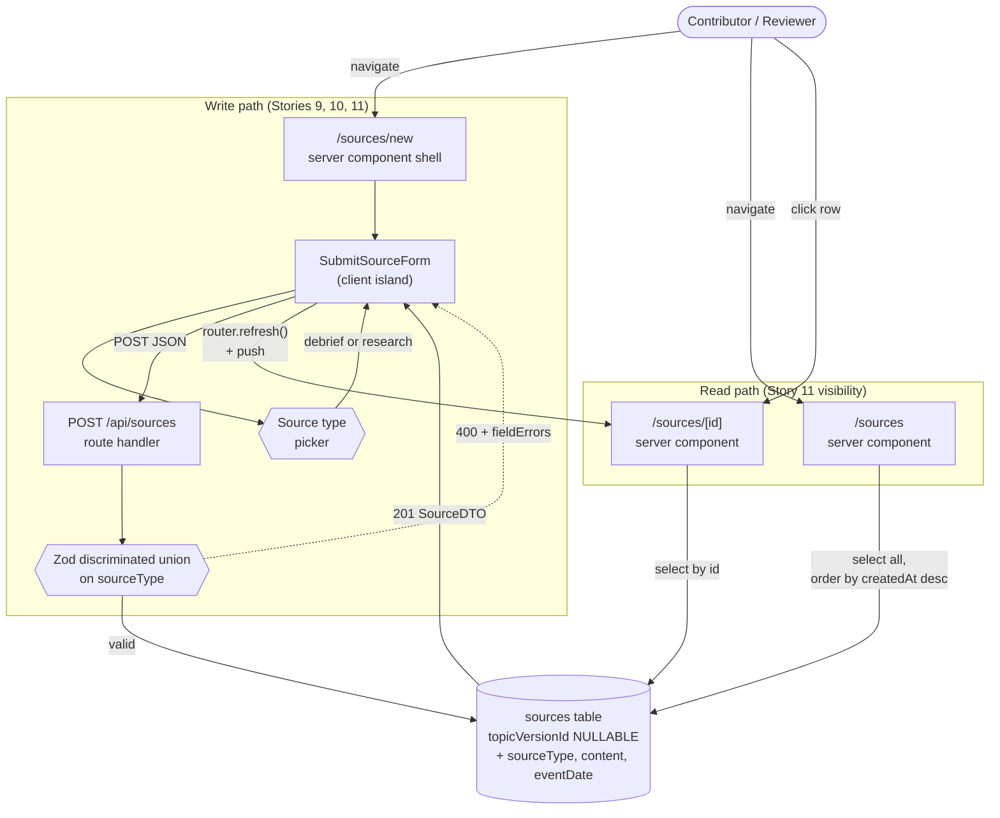

# ADR-001: Source submission and classification (Stories 9–11)

## Status

Accepted (implemented on branch `stories-9-11-source-submission`)

## Context

The course backlog (`docs/user-stories.md`) splits into two complementary halves:

- **Topic Discovery (Stories 1–6)** — already implemented. Curated guidance that clinicians read.
- **Submission of New Information (Stories 9–11)** — the focus of this ADR. Raw evidence that contributors submit, which later flows into the AI propose/approve loop (Stories 12–18).

Stories 9–11 introduce a second core domain entity — `Source` — that is the *input* side of the system. Without it, Stories 12+ have nothing to summarize, classify, or compare against guidance.

### Requirements

**For contributors (clinicians, researchers):**

- Submit a debrief report — title, the date the event occurred, free-text content
- Submit a research finding — title, citation/source metadata, summary text
- Choose source type at submission time (debrief or research, list-extensible)
- Receive confirmation that the submission was saved

**For reviewers / topic owners:**

- See a list of submitted sources to find recent submissions awaiting review
- Open a single source to read its full content
- See the source type clearly on each source (list and detail views)

**Out of scope** — deferred to later stories: AI summarization (Story 12), topic suggestion (Story 13), conflict flagging (Story 14), linking sources to topic versions (Stories 15/18), filtering, editing, and deletion.

### Pre-existing state

A `sources` table already exists in `src/db/schema.ts`, modeled narrowly for the Story 6 use case (citations attached to a published `topic_version`). It is too narrow for Stories 9–11, which need sources that exist *before* any topic linkage. This ADR widens the existing entity rather than introducing a parallel one.

## Architecture Overview



## Key Decisions

### 1. Single `sources` entity for the full submission lifecycle

**Decision:** Evolve the existing `sources` table to support the full lifecycle (submitted → triaged → linked to a topic version) rather than introducing a parallel "submissions" entity. `topic_version_id` becomes nullable; population happens in Stories 15/18 when an approved change proposal links a source to a published version.

**Alternatives considered:**
- Two separate tables: `submissions` (pre-triage) + `sources` (post-link). Copy rows on approval.
- Three tables with a join table for source ↔ topic_version many-to-many.

**Why:** A source is the same conceptual object before and after it is linked to guidance — the act of approval changes its *state*, not its identity. Two tables would force copy-on-approval (duplicate IDs, fragmented audit trail) and double the read paths. A single entity keeps identity stable across the lifecycle and makes future stories (citation listings, version-source links) trivial joins instead of cross-table reconciliation.

**Trade-off:** The table grows columns over time as new lifecycle states arrive. Mitigated by keeping new columns nullable and validating presence at the application boundary.

### 2. Unified `content` column for debrief content and research summary

**Decision:** Both source types store their primary text body in a single `content` column. The form labels it "Content" for debriefs and "Summary" for research; the DB and API treat them uniformly.

**Alternatives considered:**
- Two columns: `debrief_content` and `research_summary`, each nullable, mutually exclusive.

**Why:** Story 9 ("free-text content") and Story 10 ("summary text") describe the same architectural primitive — a body of free text — under different domain labels. One column means a single render path, a single index target if full-text search is added later, and no "which column should I read?" branching at every consumer.

**Trade-off:** The shared name is slightly less self-describing in raw DB queries. Mitigated by clear UI labels and the `sourceType` discriminator that makes intent obvious.

### 3. Discriminated-union input, flat-with-nulls output

**Decision:** The HTTP request body for `POST /api/sources` is a `z.discriminatedUnion("sourceType", [...])`. The HTTP response and detail-page DTO are flat records with nullable type-specific fields.

**Alternatives considered:**
- Symmetric: discriminated union both ways. Forces every UI consumer to disambiguate before reading shared fields like `title`.
- Symmetric: flat both ways. Loses type-narrowed validation; field-error messages become vague.

**Why:** The two boundaries serve different purposes. **Input** validation needs precise per-field errors and TypeScript narrowing inside the route handler — discriminated union excels. **Output** is consumed by rendering code that already has `sourceType` in hand and benefits from a single shape across types — flat-with-nulls excels. Picking the right shape per boundary, rather than insisting on symmetry, gives both layers what they need.

**Trade-off:** The asymmetry is non-obvious to a casual reader. Mitigated by keeping the shapes documented in this ADR and mirroring the pattern in tests.

### 4. Conditional validation at the Zod boundary, not via DB CHECK constraints

**Decision:** Type-conditional rules (`event_date` required when `sourceType = "debrief"`; `citation` required when `sourceType = "research"`) are enforced by Zod in the API route, not by Postgres CHECK constraints. The corresponding DB columns are simply nullable.

**Alternatives considered:**
- Add `CHECK (source_type <> 'debrief' OR event_date IS NOT NULL)` and similar.

**Why:** All writes go through one API route. Enforcing the rule there gives a single source of truth, the same field-level error messages other endpoints already produce, and consistent behavior with how `topicVersions.rationale` is handled (nullable in DB, transformed to undefined in Zod). DB CHECK constraints add value when multiple writers exist and the DB must self-defend; that's not the case here.

**Trade-off:** A future direct-DB writer (psql, a script) could insert an invalid combination. Acceptable for this codebase given the controlled write path.

### 5. Mandatory explicit source-type selection in the form

**Decision:** The new-source form has *no default* `sourceType`. The picker is the only visible field on first render; the rest of the form appears only after the user explicitly chooses a type.

**Alternatives considered:**
- Default to `debrief` (the more common case).
- Default to the most-recently-used type (per-user preference).

**Why:** The visible form fields determine what gets posted. A defaulted picker makes it easy to fill in fields that look right *for one type* but submit *as another* — the user thinks they're filing a research finding, but the picker is still on debrief. Forcing an explicit choice eliminates that class of bug at the cost of one extra interaction.

**Trade-off:** One additional click per submission. Acceptable; submissions are not high-frequency actions.

## Appendix: Design Levels

<details>
<summary>Full design conversation (click to expand)</summary>

### Level 1: Capabilities

**Contributors:**
- Submit a debrief report — title, date the event occurred, free-text content
- Submit a research finding — title, citation/source metadata, summary
- Choose source type at submission time (debrief or research)
- See confirmation of saved submission

**Reviewers / topic owners:**
- See a list of submitted sources
- Open a single source to read full content
- See the source type clearly in list and detail views

**Out of scope:** AI summary, topic suggestion, conflict flagging (Stories 12–14); linking source to topic / change proposal (Story 15); editing or deleting submissions; capturing a separate submitter identity; filtering by type.

### Level 2: Components

**Storage (modified):**
- `src/db/schema.ts`:
  - New `pgEnum`: `source_type` with values `["debrief", "research"]`
  - `sources.topic_version_id` → nullable (was `NOT NULL`)
  - `sources.citation` → nullable (was `NOT NULL`)
  - New `sources.source_type` (NOT NULL)
  - New `sources.content` (text, NOT NULL)
  - New `sources.event_date` (date, nullable; required at Zod when debrief)
  - New `SourceType` type alias from `sourceType.enumValues`
- New migration in `drizzle/`

**App Router (new files under `src/app/sources/`):**
- `page.tsx` — server component, list view
- `new/page.tsx` — server component shell
- `new/SubmitSourceForm.tsx` — client island, type-conditional fields
- `[id]/page.tsx` — server component, detail view
- `[id]/not-found.tsx`
- `_constants.ts` — `SOURCE_TYPE_LABELS` mirroring `AREA_LABELS`

**API (new files under `src/app/api/sources/`):**
- `route.ts` — `GET` (list), `POST` (create)
- `route.test.ts`

**Tests:** `src/app/sources/new/SubmitSourceForm.test.tsx`

**Cross-cutting:** Optional nav link in `src/app/layout.tsx` so users can find `/sources`.

**Decision deferred from L2 to this ADR:** Single-table evolution chosen — see Key Decision 1.

### Level 3: Interactions

**Submission flow:**
1. User navigates to `/sources/new`. Server component mounts client form.
2. Form initial state: no `sourceType` selected; only the picker is visible.
3. User picks a type → type-specific fields appear.
4. User fills fields, clicks Submit. Form posts a type-narrowed payload to `/api/sources`.
5. API route parses JSON (400 if malformed), validates against discriminated union (400 with `fieldErrors` if invalid), inserts via Drizzle, returns 201 with the created row.
6. Form on 201: `router.refresh()` (invalidates `/sources` list cache) → `router.push("/sources/<newId>")`.
7. Detail page renders the new source.

**Listing flow:**
1. Server component runs at request time.
2. One Drizzle query: select id, source_type, title, created_at; order by `created_at DESC`.
3. Render rows with `SOURCE_TYPE_LABELS[row.sourceType]` and `createdAt` (always — Rosa's call for consistency over conditional `eventDate`).

**Detail flow:**
1. Server component runs with `params.id`.
2. One Drizzle query by id; if missing → `notFound()`.
3. Render type-conditional content: debrief shows event date + content; research shows citation, optional URL, content (labeled "Summary").

**Type-switch interaction (form-local):**
- Switching types preserves shared fields (title, content) but discards hidden-field inputs at submit time.
- Per-field error state resets on input change.

### Level 4: Contracts

**Drizzle schema additions:**

```ts
export const sourceType = pgEnum("source_type", ["debrief", "research"]);

export const sources = pgTable("sources", {
  id: uuid("id").defaultRandom().primaryKey(),
  topicVersionId: uuid("topic_version_id")
    .references(() => topicVersions.id, { onDelete: "cascade" }), // nullable
  sourceType: sourceType("source_type").notNull(),
  title: text("title").notNull(),
  content: text("content").notNull(),
  eventDate: date("event_date"),         // nullable; required at Zod when debrief
  citation: text("citation"),            // nullable; required at Zod when research
  url: text("url"),
  createdAt: timestamp("created_at", { withTimezone: true })
    .defaultNow().notNull(),
});

export type SourceType = (typeof sourceType.enumValues)[number];
export type Source = typeof sources.$inferSelect;
export type NewSource = typeof sources.$inferInsert;
```

**Zod input schema:**

```ts
const debriefInputSchema = z.object({
  sourceType: z.literal("debrief"),
  title:     z.string().trim().min(1, "Title is required").max(200),
  eventDate: z.string().date(),
  content:   z.string().trim().min(1, "Content is required").max(10_000),
});

const researchInputSchema = z.object({
  sourceType: z.literal("research"),
  title:      z.string().trim().min(1, "Title is required").max(200),
  citation:   z.string().trim().min(1, "Citation is required").max(500),
  url:        z.string().url().optional()
                .transform((v) => (v && v.length > 0 ? v : undefined)),
  content:    z.string().trim().min(1, "Summary is required").max(10_000),
});

export const createSourceSchema = z.discriminatedUnion("sourceType", [
  debriefInputSchema,
  researchInputSchema,
]);
```

**HTTP API:**

| Endpoint | Status | Body |
|---|---|---|
| `POST /api/sources` | `201` | `SourceDTO` |
| `POST /api/sources` | `400` | `{ error: "Invalid JSON" }` or `{ error: "Validation failed", issues: { fieldErrors, formErrors } }` |
| `GET /api/sources` | `200` | `SourceListItemDTO[]` (newest first) |

**DTOs:**

```ts
type SourceDTO = {
  id: string;
  sourceType: SourceType;
  title: string;
  content: string;
  eventDate: string | null;
  citation: string | null;
  url: string | null;
  createdAt: string;
  topicVersionId: string | null;
};

type SourceListItemDTO = {
  id: string;
  sourceType: SourceType;
  title: string;
  createdAt: string;
};
```

**Constants:**

```ts
// src/app/sources/_constants.ts
export const SOURCE_TYPE_LABELS: Record<SourceType, string> = {
  debrief:  "Debrief",
  research: "Research",
};
```

**Test coverage required:**

`src/app/api/sources/route.test.ts`:
- POST debrief / research happy paths
- POST with missing type-required fields → 400 + correct `fieldErrors`
- POST with cross-type extra fields (debrief + citation) → 400
- POST malformed JSON → 400
- GET empty / populated, ordered by `createdAt DESC`

`src/app/sources/new/SubmitSourceForm.test.tsx`:
- Initial render shows only type picker
- Picking each type reveals correct fields
- Switching types preserves shared fields, discards hidden ones at submit
- Successful submit calls `router.refresh()` + `router.push("/sources/<id>")`
- Validation error → per-field message rendered

</details>
